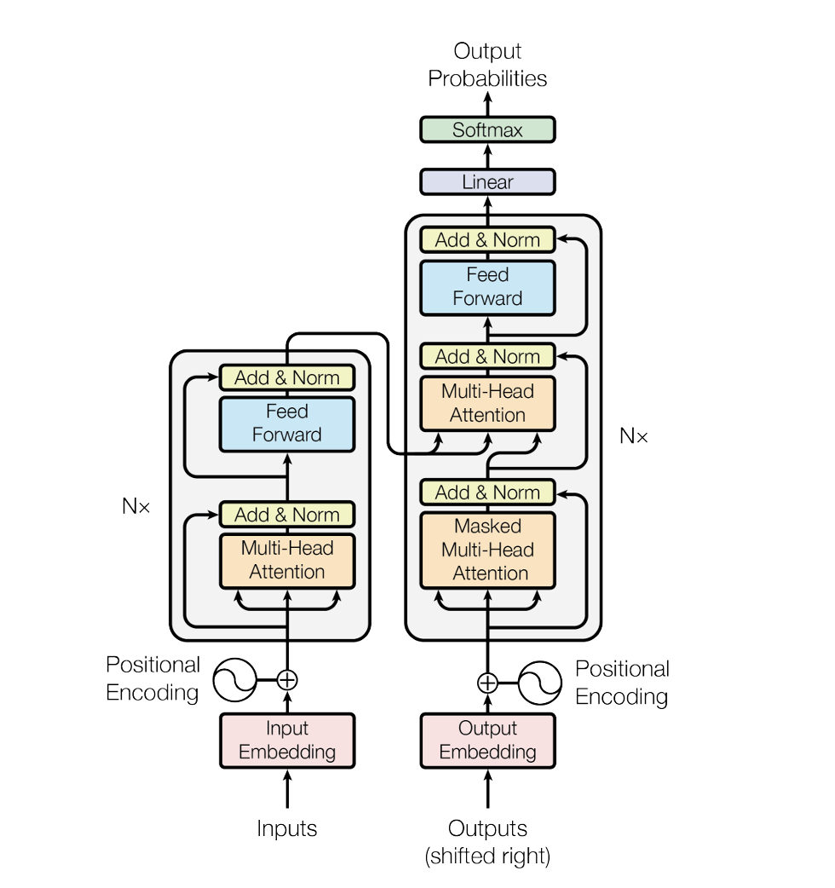

# lang2lang

Python library to easily build and train an encoder-decoder model based on the Transformer architecture outlined in "Attention is All You Need" by Vaswani et. al. I made this library for educational purposes as I wanted to understand
how the transformer model worked in-depth. The model was written from scratch using PyTorch and experiment tracking was integrated with MLflow.

## Details

The model.py file defines each "block" of the network as a custom PyTorch Module subclass. Here's
the diagram from the original paper for reference.

<p align="center">
    
    <i>The Transformer model from the paper "Attention is All You Need" [1].</i>
</p>

There is a custom module for the Embeddings, PositionalEncoding, Multi-Head Attention, Feed Forward Network,
EncoderLayer, DecoderLayer, and the overall Transformer. The various hyperparameters of the model are retrieved
from config.py file including the parameters related to the dataset as well as training related configurations.

The dataset is based on the iswlt2017 dataset and is applicable for all it's different language variations. To train
on other datasets, the dataset.py file will have to be configured for that particular dataset or the data will have to
be reformatted into the following format:

```
[
    {
        'input': 'hello'
        'output': 'bonjour'
    },
    ...
]
```

## Training

Training the model simply requires passing the config dictionary to the train function

```python
config = get_config()
train(config)
```

## Inference

Work in progress

## References

[1] - A. Vaswani et al., "Attention is All You Need," arXiv preprint arXiv:1706.03762, 2017. [Online]. Available: https://arxiv.org/abs/1706.03762.
